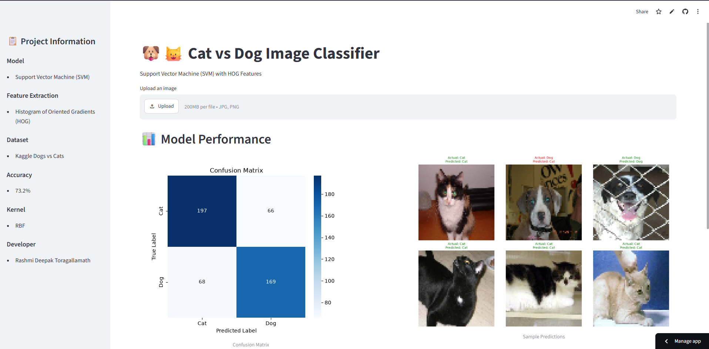
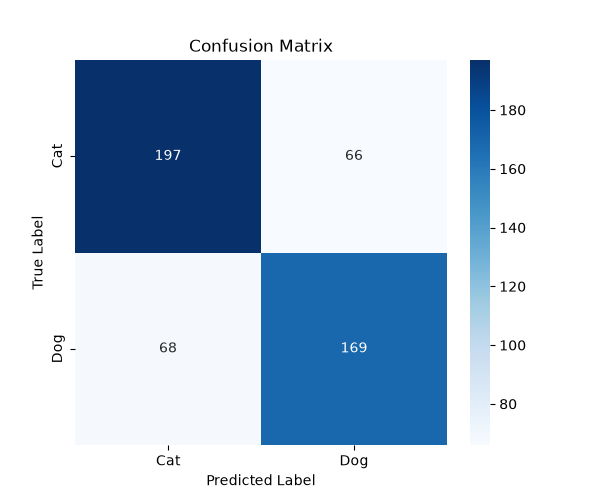
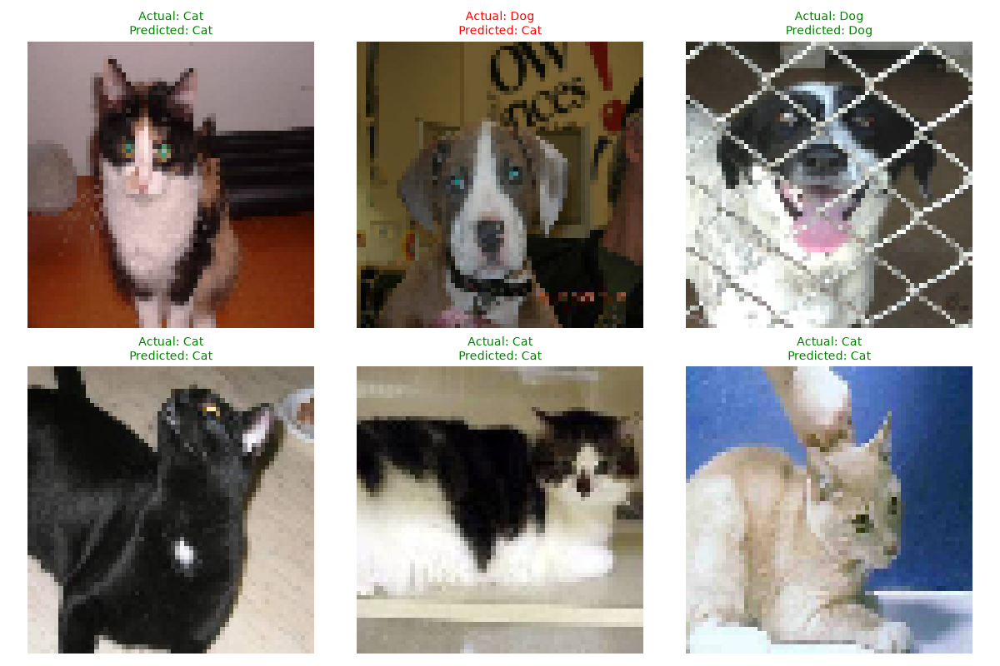
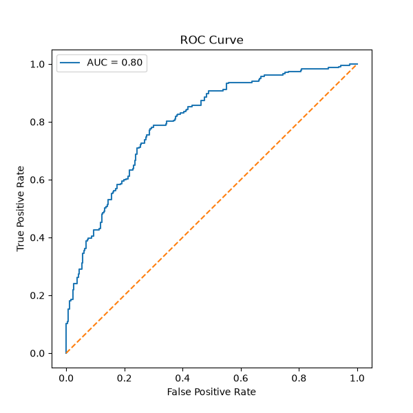

# 🐶🐱 Cat vs Dog Image Classifier using SVM & HOG


A Machine Learning project that classifies **Cats** and **Dogs** using:

- Histogram of Oriented Gradients (HOG)
- Support Vector Machine (SVM)
- Hyperparameter Tuning with GridSearchCV
- Streamlit Web Application

---

# 🌐 Live Demo

👉 **[Try the Live Demo](https://sctml03-mtcrlgrjwdtqyykhkfucoq.streamlit.app/)**
---

# 📌 Project Overview

This project demonstrates a complete Machine Learning pipeline for binary image classification using Support Vector Machines (SVM). Images are preprocessed and transformed into Histogram of Oriented Gradients (HOG) features before training an optimized SVM model using GridSearchCV. A Streamlit web application allows users to upload images and receive real-time predictions.

---

# ✨ Features

- 📤 Upload cat or dog images
- ⚡ Real-time image classification
- 🧠 HOG feature extraction
- 🤖 Support Vector Machine (SVM)
- 🔍 Hyperparameter tuning with GridSearchCV
- 📊 Confusion Matrix visualization
- 📈 ROC Curve evaluation
- 📝 Classification Report
- 💾 Trained model persistence using Joblib
- 🌐 Interactive Streamlit web application
---

# 🧠 Machine Learning Pipeline

Dataset

↓

Image Preprocessing

↓

Resize Images (64×64)

↓

Convert to Grayscale

↓

Extract HOG Features

↓

Standard Scaling

↓

GridSearchCV

↓

Train SVM

↓

Save Model (.pkl)

↓

Streamlit Deployment

---

# 📊 Model Performance

| Metric | Value |
|---------|--------|
| Accuracy | **73.2%** |
| Algorithm | SVM |
| Kernel | RBF |
| Feature Extraction | HOG |

---

# 📷 Screenshots


---

## Confusion Matrix



---

## Sample Predictions



---

## ROC Curve



---

# 📂 Dataset

Dataset Used:

**Dogs vs Cats**

Source:

https://www.kaggle.com/c/dogs-vs-cats

> The dataset is not included in this repository because of its size.

Folder Structure:

dataset/

├── train/

│ ├── cats/

│ └── dogs/

└── test/

├── cats/

└── dogs/

---

# 🛠 Tech Stack

- Python
- OpenCV
- NumPy
- Scikit-learn
- Scikit-image
- Matplotlib
- Joblib
- Streamlit

---

# 📁 Project Structure

```text
SCT_ML_03/
│
├── assets/
│   └── app_home.png
│
├── models/
│   ├── svm_model.pkl
│   └── scaler.pkl
│
├── results/
│   ├── confusion_matrix.png
│   ├── sample_predictions.png
│   ├── roc_curve.png
│   ├── metrics.json
│   └── classification_report.txt
│
├── app.py
├── svm_cat_dog.py
├── requirements.txt
├── README.md
└── .gitignore
```
---

# ⚙ Installation

Clone Repository

```bash
git clone https://github.com/rashmideepaktoragallamath/SCT_ML_03.git
```

Install dependencies

```bash
pip install -r requirements.txt
```

Run the Streamlit App

```bash
streamlit run app.py
```

---

# 🎯 Future Improvements

- 🔹 Deep Learning implementation using CNNs
- 🔹 Confidence score visualization
- 🔹 Batch image prediction
- 🔹 Explainable AI (Grad-CAM)
- 🔹 Docker containerization
- 🔹 Cloud deployment with AWS or Azure
- 🔹 REST API integration using FastAPI
---

# 👨‍💻 Developer

**Rashmi Deepak Toragallamath**

Machine Learning | Data Science | Computer Vision Enthusiast

GitHub:
https://github.com/rashmideepaktoragallamath

---


⭐ If you found this project helpful, consider giving it a Star!